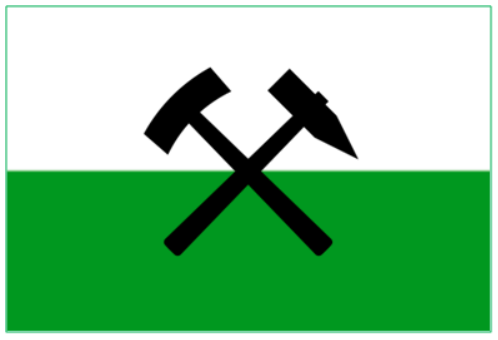

# Office-Sharing Projektpräsentation

|          Logo von Bad Erzland           |                                             Logo der SecNetIT                                              |
|:---------------------------------------:|:----------------------------------------------------------------------------------------------------------:|
|  |  |

## Begrüßung

:fontawesome-solid-circle-exclamation: Es wird Zeit für die Digitalisierung!

Im Zuge der Digitalisierung des Gemeindezentrums Bad Erzland hat unsere Firma Profi-SecNetIT GmbH den Auftrag erhalten ein Office-Sharing System zu entwerfen und in Betrieb zu nehmen.

> * „Die Gemeindeverwaltung von Bad Erzland möchte im Rahmen der gesellschaftlichen digitalen Transformation und damit verbundener neuer Arbeitsformen Officesharing zur Miete als Alternative für das Homeoffice [...] anbieten.“(Fachkonzept Z.1ff)

In der Office-Sharing Anwendung sollen Nutzer die Möglichkeit haben, Arbeitsplätze Online zu buchen, um so Zeit und Organisationsaufwand zu sparen.

Im Folgenden stellen wir euch die Softwarelösung von uns vor!

## Aufgabenverteilung

| Mitarbeiter        | Fachbereich           | Verantwortung/ Aufgaben |
|--------------------|-----------------------|-------------------------|
| Thomas Nürk        | Anwendungsentwicklung | Projektleiter           |
| Cora Helm          | Systemintegration     | Fachbereichsleitung     |
| Richard Lehmann    | Systemintegration     | Entwickler              |
| Pascal Geithner    | Anwendungsentwicklung | Fachbereichsleitung     |
| Jannik Heinrich    | Anwendungsentwicklung | Entwickler              |
| Julius Rosenlöcher | Anwendungsentwicklung | Dokumentarist           |

## Gliederung

### 1. Projektauftrag
### 2. Showcase User-Stories
### 3. Projektdefinition
### 4. AE-Module
### 5. SI-Module
### 6. Reflexion

