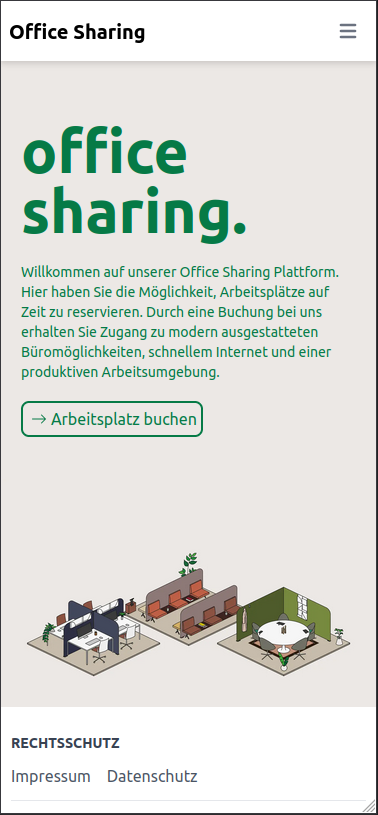

# Frontend

Wir haben uns in der Planungsphase gründlich mit den Informationen beschäftigt, die für den Buchungsprozess erforderlich sind. Dabei haben wir Schritte, die zusammengehören, zusammengefasst und in übersichtliche Abschnitte unterteilt, um die Bedienbarkeit zu optimieren. Auch das Zusammenspiel mit anderen Komponenten wie dem Login und der Registrierung haben wir dabei berücksichtigt.

## Entwurf
### Erster Entwurf

Wir haben unsere Planung in die Tat umgesetzt und einen ersten Entwurf in Figma erstellt. Während des Schaffensprozesses haben wir uns die Freiheit genommen, kleine Anpassungen am Ablauf vorzunehmen, die erst durch die visuelle Darstellung offenbart wurden und so das Gesamtergebnis verbessern konnten. 

### Entwurfsüberarbeitung

Nach der Erstellung des Entwurfs haben wir uns entschlossen, das Design noch einmal anzupassen, um es moderner und benutzerfreundlicher zu gestalten. Durch die Erhöhung der Kontraste haben wir das Design intuitiver und damit leichter zu verstehen und zu bedienen gemacht. 

## Umsetzung des Designs

Wir haben die reinen HTML-Ausgaben, die wir vom Backend erhalten haben, an unsere Designvorlage angepasst. Dabei haben sich einige Darstellungen noch einmal verschoben.

## Responsive UI-Design

Das [Responsive Design](https://de.wikipedia.org/wiki/Responsive_Webdesign) im Projekt wurde mittels [CSS](https://de.wikipedia.org/wiki/Cascading_Style_Sheets) umgesetzt.
Durch das Auslesen der Auflösung des entsprechenden Gerätes wird die Oberfläche angepasst.

Auch die Auflösung und größe der Bilder wird durch das Framework [Next JS](https://nextjs.org/) automatisch verkleinert und angepasst, um die Ladezeit und den [FCP](https://developer.mozilla.org/en-US/docs/Glossary/First_contentful_paint) so klein wie möglich zu halten.

Das Design der Website wurde sowohl für die Benutzung mit Computer, Smartphone sowie Tablet konzeptioniert und umgesetzt.

### Startseiten Vergleich Desktop und Smartphone

|              iPhone 13              |            Windows Desktop             |
|:-----------------------------------:|:--------------------------------------:|
|  |  |

### Buchungsprozess Vergleich Desktop und Smartphone

|                    iPhone 13                    |             Windows Desktop             |
|:-----------------------------------------------:|:---------------------------------------:|
|  |  |

> Der Wizard für die Buchung ist mit den für Touch-Geräte optimierten Buttons leicht zu bedienen.

### Navigation auf dem Smartphone

|                 iPhone 13                  |
|:------------------------------------------:|
|  |

> Für die Navigation auf der Website mit einem Smartphone wurde eine Sidebar eingefügt.