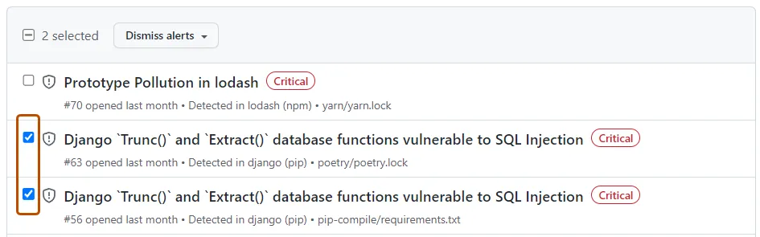

# Sicherheit

## Vom BSI definierte Datenverschlüsselung

Das [BSI](https://www.bsi.bund.de) hat eine [Empfehlung](https://www.bsi.bund.de/SharedDocs/Downloads/DE/BSI/Publikationen/TechnischeRichtlinien/TR03116/BSI-TR-03116.pdf?__blob=publicationFile&v=1) herausgegeben, die die Datenverschlüsselung in Deutschland regelt. Diese Empfehlung ist für alle Behörden und Unternehmen verbindlich. Sie ist in der [BSI-Grundschutz-Kataloge](https://www.bsi.bund.de/DE/Themen/Grundschutz/GrundschutzKataloge/GrundschutzKataloge_node.html) verankert.

Eine dieser Empfehlung ist die Nutzung des Blowfish-Algorithmus. Die Nutzung des Blowfish-Algorithmus ist in einer Handhabung für sichere Passwörter in Embedded Devices des BSI empfohlen.

> Weiterhin sollten Passwörter immer unter Verwendung hinreichend sicherer kryptografischer
Mechanismen gespeichert und übertragen werden. Beispielsweise bietet es sich an, Password-
Based Key Derivation Function 2 (PBKDF2), bcrypt (auf Basis des Kryptoalgorithmus Blowfish)
o. ä. zu verwenden. Zumindest sollte aber ein Salted Hash genutzt werden, bei dem als Eingabe
in eine Hashfunktion neben dem Passwort ein Zufallswert eingeht, um Angriffe mit vorbe-
rechneten Daten zu erschweren. Verfahren wie MD5 oder SHA-1 (ohne Salt) sind als unsicher
zu bewerten. Von einer Verwendung ist daher abzuraten.
> [BSI-CS_069](https://www.allianz-fuer-cybersicherheit.de/SharedDocs/Downloads/Webs/ACS/DE/BSI-CS/BSI-CS_069.pdf?__blob=publicationFile&v=1)


## Blowfish

Zur Verschlüsselung des Passworts wird der Blowfish Algorithmus verwendet. Durch das benutzten der Bibliothek [bcrypt](https://en.wikipedia.org/wiki/Bcrypt) wird das Passwort mit einem zufälligen Salt verschlüsselt. Das verschlüsselte Passwort wird dann in Form eines Hashes in der Datenbank gespeichert.

Somit ist eine Verschlüsselung des Passworts gegeben.

```typescript
import {hash} from 'bcrypt';

const hashedPassword: string = await new Promise((resolve, reject) => {
    hash(req.body.password, 10, (err, hash) => {
        if (err) reject(err);
        resolve(hash);
    });
});
```

!!! success "Beispiel Hash"
    
    | Passwort | Hash |
    |----------|------|
    | test | `$2b$10$dy6/Qz5aOk1q27qDSMVzh.fRrs9RLuYSwGhGTVmL9sJgzRp1GQM2S` |


Weitere Informationen zur Funktionsweise und der Sicherheit des Algorithmus finden Sie hier [Wikipedia](https://en.wikipedia.org/wiki/Blowfish_(cipher)).


Zur weiteren Einschätzung des Sicherheitsrisikos ist die Risikoanalyse zu beachten.

[Risikoanalyse :material-file-chart-outline:](00_Analyse.md#risikoanalyse){ .md-button }


## HTTPS Verbindung

Durch die Verwendung von HTTPS ist eine sichere Verbindung zwischen dem Client und dem Server gegeben.

Für die Erstellung der Zertifikate wurde ein Zertifikatsserver verwendet. Mehr Informationen finden Sie hier:

[Zertifikatsserver :material-certificate-outline:](../09_si-module/server/06_Zertifikatsserver.md#erstellen){ .md-button }

### Gründe für die Verwendung von HTTPS

#### 1. Schutz der Datenintegrität
Es wird eine Datenverschlüsselung zwischen dem Client und dem Server gewährleistet, um sicherzustellen, dass sie nicht während der Übertragung manipuliert werden.

#### 2. Schutz der Datenvertraulichkeit
HTTPS verschlüsselt Daten zwischen dem Client und dem Server, um sicherzustellen, dass sie nur von autorisierten Personen gelesen werden können.

#### 3. Schutz vor Man-in-the-Middle-Angriffen
Es wird ein Schutz vor Man-in-the-Middle-Angriffen, bei denen ein Angreifer versucht, Daten während der Übertragung zu manipulieren, gewährleistet.

#### 4. Vertrauenswürdigkeit
HTTPS wird von vertrauenswürdigen Zertifizierungsstellen ausgegeben, um sicherzustellen, dass die Website, mit der der Benutzer kommuniziert, tatsächlich diejenige ist, für die sie sich ausgibt.

#### 5. SEO-Vorteile
Google bevorzugt Websites mit HTTPS-Verschlüsselung und belohnt diese in den Suchergebnissen.


## Sichere Datenbankkommunikation

Durch die Verwendung von Prisma und der Überprüfung der Request Payload ist eine sichere Datenbankverbindung gegeben.

## Schutz vor SQL-Injection

Prisma verwendet einen Query-Builder, der es Benutzern ermöglicht, Abfragen zu erstellen, indem sie Methodenaufrufe anstelle von Strings verwenden. Dies minimiert das Risiko von Fehlern bei der Eingabe von SQL-Abfragen.
Weiterhin werden Benutzereingaben zur Laufzeit validiert, bevor sie in Abfragen verwendet werden. Dadurch wird sichergestellt, dass Benutzer keine ungültigen Eingaben übergeben können, die SQL-Injections ermöglichen könnten.

```ts
const reservation = await prisma.customer.create({
    data: {
        name: req.body.name,
        surname: req.body.surname,
        email: req.body.email,
        gender: req.body.gender,
        password: hashedPassword,
        address: {
            create: {
                street: req.body.street,
                streetNumber: +req.body.streetNumber,
                zipCode: +req.body.zipCode,
                city: req.body.city,
            }
        },
        booking: {
            create: {
                ...
            }
        }
    },
});
```

## Security Headers

### X-XSS-Protection

Dies Header blockiert bei Verdacht auf Cross-Site-Scripting (XSS) die Ausführung des Scripts.

```js
{
  key: 'X-XSS-Protection',
  value: '1; mode=block'
}

```

### X-Frame-Options

Die Header blockiert das Anzeigen der Website in einem iFrame. Die gewährleistet einen Schutz vor Clickjacking.

```js
{
  key: 'X-Frame-Options',
  value: 'SAMEORIGIN'
}
```

### Content-Security-Policy


```js

const ContentSecurityPolicy = `
default-src 'self';
script-src 'self';
child-src buchung.gz-bad-erzland-p2.de;
style-src 'self' buchung.gz-bad-erzland-p2.de;
font-src 'self';
`

{
  key: 'Content-Security-Policy',
  value: ContentSecurityPolicy.replace(/\s{2,}/g, ' ').trim()
}
```

Alle von [NextJS](https://nextjs.org/docs/advanced-features/security-headers) empfohlen Header wurden zum Schutz der Webseite implementiert.

## Automatisierte Sicherheitsprüfung/ Aktualisierung von 3rd Party Bibliotheken

Durch die Verwendung von Dependabot werden automatisch Sicherheitsupdates für 3rd Party Bibliotheken durchgeführt. Dependabot überprüft täglich die verwendeten Bibliotheken auf Sicherheitslücken und erstellt automatisch Pull Requests, wenn neue Versionen verfügbar sind. Dadurch wird die Sicherheit von 3rd Party Bibliotheken gewährleistet.

Dependabot erstellt automatisch ein Rating für die Schwere der Sicherheitslücke. Je nach Priorität werden Empfehlungen für die Sicherheitslücke gegeben.

Beispiel für eine Meldung von Dependabot:



Quelle: Github[^5][^6]

Dependabot ist ein Service von GitHub. Weitere Informationen finden Sie hier:

[Dependabot :material-github:](https://docs.github.com/en/code-security/dependabot/dependabot-alerts/about-dependabot-alerts){ .md-button }

[^1]: https://www.allianz-fuer-cybersicherheit.de/SharedDocs/Downloads/Webs/ACS/DE/BSI-CS/BSI-CS_069.pdf?__blob=publicationFile&v=1 (17.01.2023)
[^2]: https://en.wikipedia.org/wiki/Bcrypt (17.01.2023)
[^3]: https://www.bsi.bund.de/SharedDocs/Downloads/DE/BSI/Publikationen/TechnischeRichtlinien/TR03116/BSI-TR-03116.pdf?__blob=publicationFile&v=1 (16.01.2023)
[^4]: https://nextjs.org/docs/advanced-features/security-headers (01.03.2023)
[^5]: https://docs.github.com/assets/cb-41817/mw-1000/images/help/graphs/select-multiple-alerts.webp (17.01.2023)
[^6]: https://docs.github.com/en/code-security/dependabot/dependabot-alerts/viewing-and-updating-dependabot-alerts (17.01.2023)
