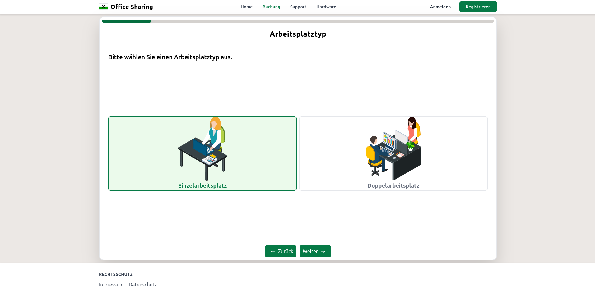

# Responsive UI-Design

Das [Responsive Design](https://de.wikipedia.org/wiki/Responsive_Webdesign) im Projekt wurde mittels [CSS](https://de.wikipedia.org/wiki/Cascading_Style_Sheets) umgesetzt. 
Durch das Auslesen der Auflösung des entsprechenden Gerätes wird die Oberfläche angepasst.

Auch die Auflösung und größe der Bilder wird durch das Framework [Next JS](https://nextjs.org/) automatisch verkleinert und angepasst, um die Ladezeit und den [FCP](https://developer.mozilla.org/en-US/docs/Glossary/First_contentful_paint) so klein wie möglich zu halten.

Das Design der Website wurde sowohl für die Benutzung mit Computer, Smartphone sowie Tablet konzeptioniert und umgesetzt.

## Startseiten Vergleich Desktop und Smartphone

|              iPhone 13              |            Windows Desktop             |
|:-----------------------------------:|:--------------------------------------:|
|  |  |

## Buchungsprozess Vergleich Desktop und Smartphone

|                    iPhone 13                    |             Windows Desktop             |
|:-----------------------------------------------:|:---------------------------------------:|
|  |  |

> Der Wizard für die Buchung ist mit den für Touch-Geräte optimierten Buttons leicht zu bedienen.

## Navigation auf dem Smartphone

|                 iPhone 13                  |
|:------------------------------------------:|
|  |

> Für die Navigation auf der Website mit einem Smartphone wurde eine Sidebar eingefügt.