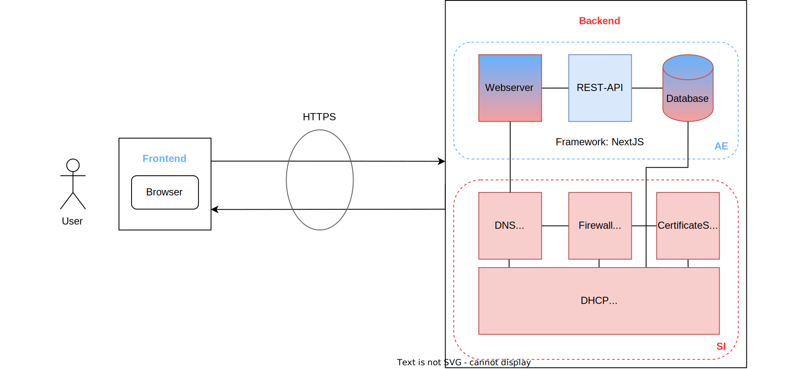

# Fachkonzeptmodellierung & Architekturbeschreibung

## Fachkonzeptmodellierung

### Fachbereich Anwendungsentwicklung
- Javascript/ NodeJS
    - Typescript
    - NextJS 13
      - React
      - ==Webpack==
-  CSS
    - TailwindCSS
    - ==PostCSS==
- Datenbank (MySQL)
    - Prisma ORM

### Fachbereich Systemintegration

Für den Fachbereich Systemintegration wurde ein Netzwerkplan erstellt, der die Fachkonzeptmodellierung darstellt.

[Link zur SI Fachkonzeptmodellierung](../09_si-module/server/00_Allgemein.md){ .md-button }

## Architekturbeschreibung des Gesamtsystems

---

