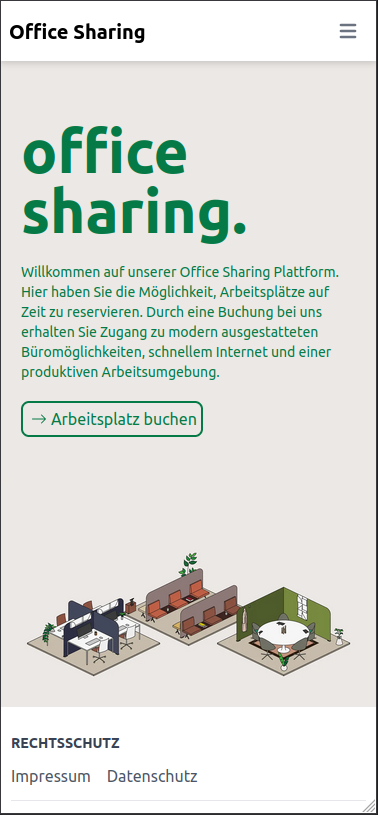
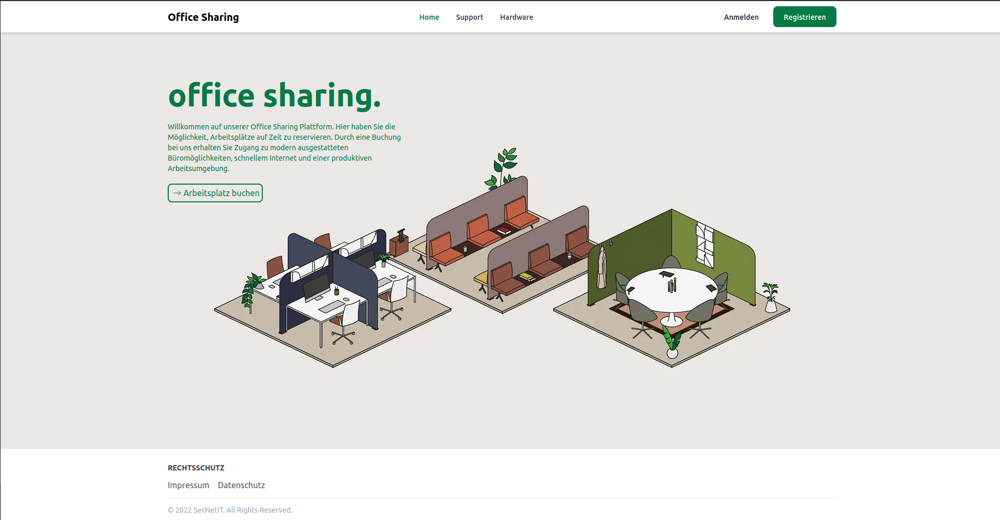

# Responsive UI-Design

Das [Responsive Design](https://de.wikipedia.org/wiki/Responsive_Webdesign) im Projekt wurde mittels [CSS](https://de.wikipedia.org/wiki/Cascading_Style_Sheets) umgesetzt. 
Durch das Auslesen der Auflösung des entsprechenden Gerätes, wird die Öberfläche angepasst.

Auch die Auflösung und größe der Bilder wird durch das Framework [Next JS](https://nextjs.org/) automatisch verkleinert und angepasst, um die Ladezeit und den [FCP](https://developer.mozilla.org/en-US/docs/Glossary/First_contentful_paint) so klein wie möglich zu halten.

iPhone 13            |  Windows Desktop
:-------------------------:|:-------------------------:
 | 

